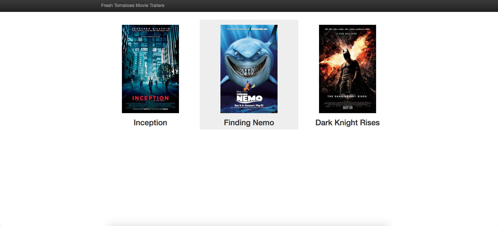

# Udacity Movie Trailer Project 

This project is a small prototype representing IMDB functionality.

It has the following features

  - Adding new movies into its database
  - A website which shows all the movies in its database with trailers
  
### Prequisites
- Python 2.7+

### Dependencies
- No additional python dependencies

### How to run
##### Execute the below command to add a new movie into its database
```python movietrailer.py add -t "<movie_title>" -i "<movie_box_art_url>" -y "<movie_youtube_trailer_url>"```

Example for adding new movies
```
python movietrailer.py add -t "Inception" -i "http://t2.gstatic.com/images?q=tbn:ANd9GcRo9vfJCM6dzPkZHIHBVCtlJnAnew9Ai26kEdrli0-tfmatmciD" -y "https://www.youtube.com/watch?v=8hP9D6kZseM"

python movietrailer.py add -t "Finding Nemo" -i "https://vignette.wikia.nocookie.net/pixar/images/9/93/Finding_nemo_ver2_xlg.jpg/revision/latest?cb=20110414150223" -y "https://www.youtube.com/watch?v=wZdpNglLbt8"
```

##### Execute the below command to launch the website
```python movietrailer.py launch```

### Demo


If you cannot see any image above please click on demo.png bundled with this project to see the demo screenshot
